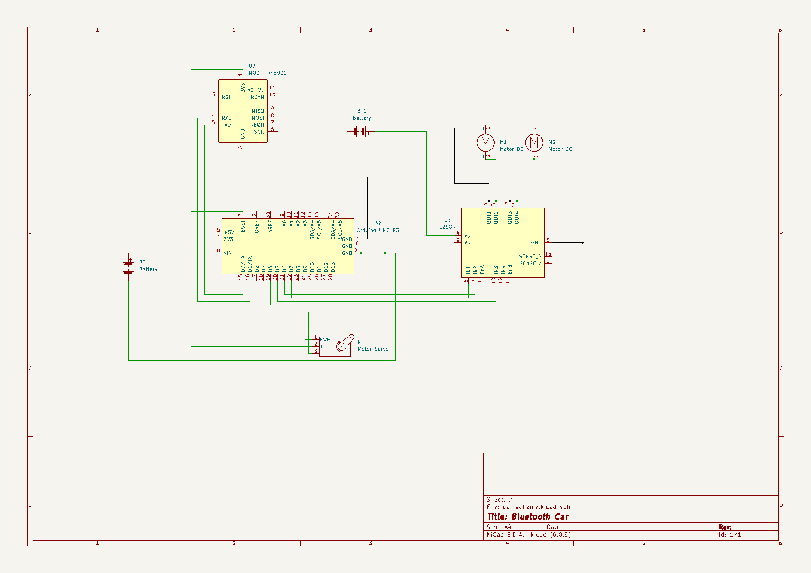

# Bluetooth Vozítko

### Autor: Adam Hajdík
### Konzultanti: Marcel Godovský, Petr Grussmann

## CÍLE:

1. Dálkové ovládání pomocí telefonu
2. Různé stupně rychlosti
3. 3D tisknuý podvozek
4. Zařízení pro přenos lehkých předmětů

## HARDWARE:

Arduino UNO

Bluetooth Modul HC-05

L298N

## SCHÉMA ZAPOJENÍ:

## HARMONOGRAM:

Září: -Sehnáni hardwaru&#9745; -Zkouška propojení s bluetooth&#9745;

Říjen: -Zprovoznění ovládání motorů&#9745; -Schéma zapojení&#9745;

Listopad: -Nosné zařízení&#9744; -3D tisk komponentů&#9744;

Prosinec: -Doladění chyb&#9744; -Sepsání dokumentace&#9744;

### ZDROJE:
[Data sheet: HC-05](https://components101.com/sites/default/files/component_datasheet/HC-05%20Datasheet.pdf)

[Data sheet: L298N](https://components101.com/modules/l293n-motor-driver-module)

[Tutoriál na pájení](https://www.youtube.com/watch?v=6rmErwU5E-k)

[Návod: Modul HC-05](https://www.youtube.com/watch?v=L13jJPg88EI)

